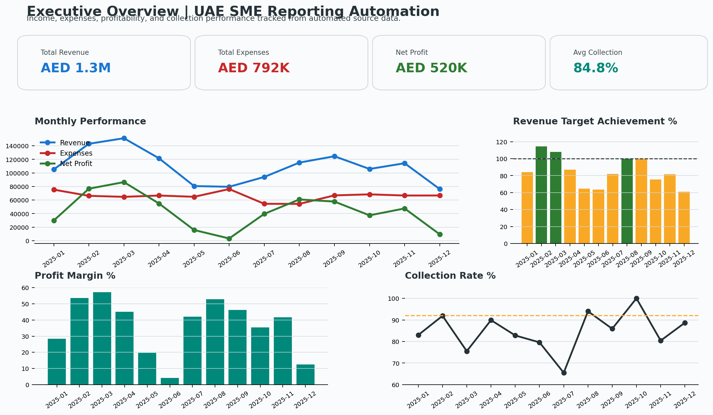
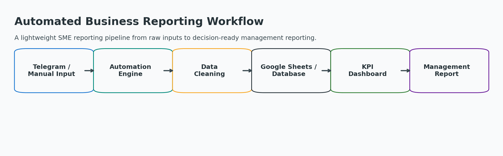
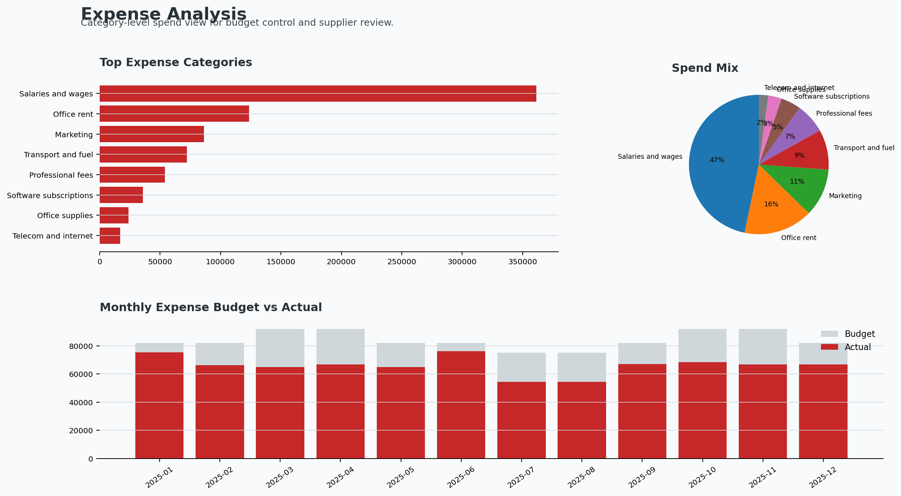
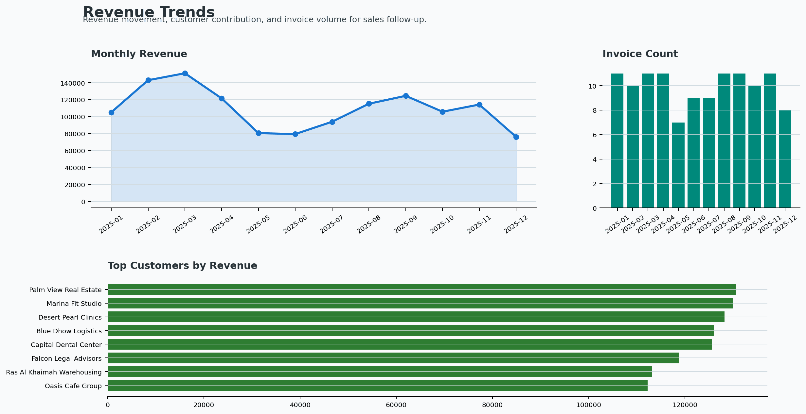
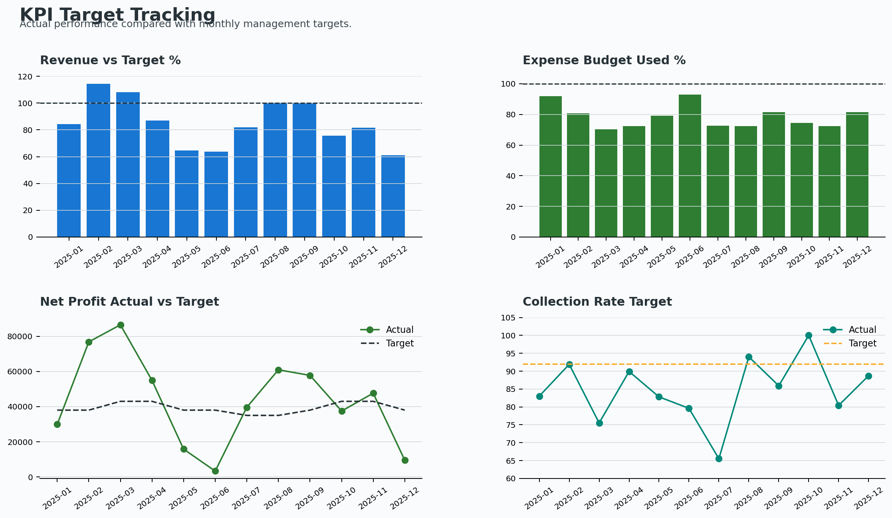

# Automated Business Reporting Workflow

**Career positioning:** Business Intelligence Analyst | Data & Automation Specialist

This project demonstrates how I improve business operations using data, dashboards, and automation. It simulates a practical reporting workflow for a UAE SME service business, from raw income and expense records to clean KPI dashboards and management reporting outputs.



## Business Problem

Many SMEs track income, expenses, collections, and operational KPIs across manual spreadsheets, accounting exports, and messaging tools. This creates repeated manual work, inconsistent categories, delayed reporting, and limited visibility into profit and cash collection.

## Solution

This repository builds a lightweight automated reporting workflow that:

- Generates realistic sample UAE SME business data in AED.
- Cleans and transforms income, expense, customer, and transaction records.
- Calculates monthly revenue, expenses, net profit, profit margin, collections, and target performance.
- Provides SQL queries for repeatable KPI analysis.
- Exports recruiter-friendly dashboard screenshots and management report tables.

The project is intentionally practical and believable for a strong junior BI/data automation candidate. It avoids unnecessary heavy frameworks and focuses on business value.

## Workflow



**Telegram / Manual Input -> Automation Engine -> Data Cleaning -> Google Sheets / Database -> KPI Dashboard -> Management Report**

## Tools Used

- Python
- pandas
- matplotlib
- CSV files
- SQL
- Markdown documentation

## Repository Structure

```text
automated-business-reporting-workflow/
├── README.md
├── AGENTS.md
├── requirements.txt
├── data/
│   ├── transactions.csv
│   ├── expenses.csv
│   ├── income.csv
│   ├── customers.csv
│   ├── kpi_targets.csv
│   ├── monthly_summary.csv
│   └── processed/
├── src/
│   ├── generate_sample_data.py
│   ├── clean_transform_data.py
│   ├── generate_kpi_report.py
│   └── create_dashboard_screenshots.py
├── sql/
│   ├── create_tables.sql
│   ├── business_kpi_queries.sql
│   └── monthly_reporting_queries.sql
├── dashboards/
│   ├── executive_overview.png
│   ├── expense_analysis.png
│   ├── revenue_trends.png
│   ├── kpi_target_tracking.png
│   └── outputs/
├── workflow/
│   └── workflow_notes.md
├── docs/
│   ├── business_case.md
│   └── data_dictionary.md
└── assets/
    └── workflow_diagram.png
```

## KPIs Tracked

- Monthly revenue
- Monthly expenses
- Net profit
- Profit margin
- Revenue target achievement
- Expense budget usage
- Collection rate
- Active customers
- Invoice count
- Customer revenue contribution
- Cash vs bank/digital transaction mix

## Dashboard Screenshots

### Executive Overview


### Expense Analysis



### Revenue Trends



### KPI Target Tracking



## How to Run

Install dependencies:

```bash
pip install -r requirements.txt
```

Generate sample business data:

```bash
python src/generate_sample_data.py
```

Clean and transform the data:

```bash
python src/clean_transform_data.py
```

Generate KPI report outputs:

```bash
python src/generate_kpi_report.py
```

Create dashboard screenshots and workflow diagram:

```bash
python src/create_dashboard_screenshots.py
```

## Sample Business Impact

This workflow shows how an SME can reduce manual monthly reporting work and create consistent visibility into:

- Revenue and expense movement.
- Profitability by month.
- Collection performance.
- Budget control.
- Customer activity.
- Management reporting follow-up areas.

In a real business setting, this type of workflow can help owners and managers make faster decisions using clean, repeatable data instead of manually prepared spreadsheets.

## Portfolio Note

All data in this repository is synthetic and anonymized for portfolio demonstration. The company names, customers, transactions, and financial values are sample records created to represent a realistic UAE SME service business.
